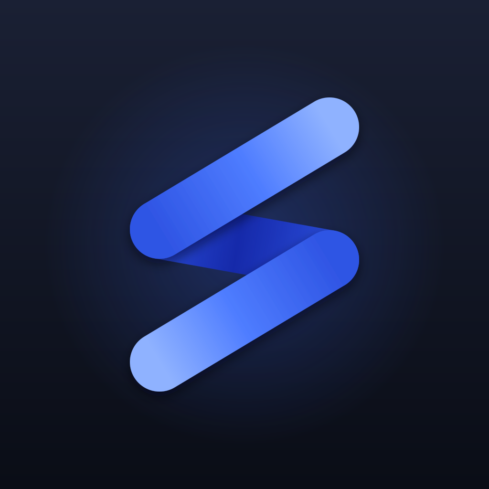

# Stonqs

**Serious portfolio analytics in a local-first desktop app.**

True time-weighted and money-weighted returns, lots and realised gains, classification trees and
rebalancing, broker CSV import in any language — on your computer, encrypted if you want it,
with no account and no server.

<!-- TODO before making the repository public: replace with a real screenshot of the dashboard on
     demo data, light and dark. A README without a picture does not get read. -->

## Why

**Numbers you can check.** Returns are computed the way a portfolio-analysis tool should compute
them — time-weighted return with the timing of your deposits removed, money-weighted return with
it included, realised gains built from the lots a sale actually consumed. Every calculation has a
test that works the arithmetic out longhand in a comment before performing it in code, and the
decisions behind them are written down as [architecture decision records](docs/decisions/).

**Your data is a file you own.** No account, no server, no telemetry, no sync you did not ask for.
The portfolio is a local SQLite database; give a profile a password and the whole database is
encrypted with SQLCipher and the keys sealed under Argon2id. The app talks to the network only to
fetch prices, exchange rates and inflation figures.

**Import that does not need a template.** Point it at a broker export in any of a dozen languages:
the delimiter, encoding, date format, decimal separator and column meanings are detected and every
one of them stays overridable. You see every row and fix it before anything is written, and
re-importing the same file changes nothing.

**An assistant only if you want one.** Off until you add your own provider key — OpenAI, Anthropic,
Gemini, or any OpenAI-compatible address including a model running on your own machine. It asks
before each reading of your portfolio and asks again, every single time, before changing anything.

## Install

Alpha. Download the build for your platform from the
[latest release](https://github.com/vvvlladimir/stonqs/releases).

There is no code signing yet, so the operating system will warn you that the developer is
unidentified:

- **macOS** — after moving the app to Applications:
  `xattr -dr com.apple.quarantine /Applications/Stonqs.app`
- **Windows** — SmartScreen: *More info* → *Run anyway*.

That is not acceptable long-term and it will be fixed. Until then, you can also
[build from source](CONTRIBUTING.md#getting-set-up) — which is the point of the code being here.

On first launch, **Try with demo portfolio** fills a profile with a sample history so you can see
what everything does before handing over anything of your own.

## What it does

- **Performance** — time-weighted and money-weighted returns over any period, per portfolio and
  per position, against a benchmark, and in real terms against a consumer-price index.
- **Risk** — volatility, maximum drawdown with its recovery, Sharpe, semi-deviation, best and
  worst days.
- **Positions and lots** — FIFO or average cost, side by side, with the currency's share of a
  result separated from the instrument's.
- **Income** — dividends and interest by year and instrument, yield on cost, expected payments,
  and what the whole thing costs you in fees and taxes.
- **Allocation and rebalancing** — your own classification trees (asset class, region, sector, or
  anything you invent), target weights, and proposed trades rounded to what you can actually buy.
- **Accounts in any currency** — cash and securities accounts settle through each other; every
  trade keeps the exchange rate it was made at.
- **A lens on the data** — look at one account, a group of them, or everything, without editing
  anything.
- **Import** — 29 broker layouts ship with the app (Trade Republic, DEGIRO, Trading 212, IBKR,
  Saxo, Swissquote, Revolut, Coinbase and more), an Interactive Brokers Flex statement reads
  directly, and an unknown export is mapped in the interface and saved as your own layout.
- **Alerts, watchlists and investment plans** — price levels with a crossing log, lists of
  instruments you do not own yet, and a savings plan that proposes the transactions rather than
  writing them behind your back.
- **A dashboard you arrange** — tiles on a grid, each with its own period and data scope.
- **English and Russian**, and the app follows your system language.

## Privacy

Every network call the app makes, and when:

| What | Where it goes | When |
|---|---|---|
| Prices | Yahoo Finance by default; Twelve Data, EODHD or Kraken if you configure them | When quotes are refreshed |
| Exchange rates | European Central Bank, Frankfurter, Yahoo | With quotes |
| Inflation figures | Eurostat, IMF | Only if you pick a region for real returns |
| Instrument lookup | Yahoo, OpenFIGI | When you search for or identify an instrument |
| AI assistant | The provider *you* configured, with *your* key | Only when you use it |

Nothing else leaves the machine. There is no account, no analytics, no crash reporting and no
update ping. The market-data sources are free public endpoints; you can switch them, add your own,
or turn them off and enter prices by hand.

See [SECURITY.md](SECURITY.md) for what the profile password does and does not protect against.

## Status

**Alpha**, version 0.x. It is used daily by its author and the calculations are covered by tests,
but you should expect rough edges and you should keep your broker statements. Before a schema
upgrade the app copies your database beside itself, and reports can be exported at any time.

Desktop only for now — macOS, Windows, Linux. The code is written to run on iOS and Android from
the same source, but those builds are not shipped yet.

## Money

The application and every local feature are free and open source under the AGPL, and will stay
that way. If paid services ever appear they will be things that genuinely cost money to run —
device sync, hosted AI, licensed market data — and never a paywall in front of what works today.

## Contributing

Issues, broker formats that fail to import, and pull requests are all welcome — start with
[CONTRIBUTING.md](CONTRIBUTING.md). If you attach a broker export, **strip the real amounts and
account numbers first**; five rows and the header are enough.

This project was built with heavy use of AI coding tools, which is not hidden because it is not
shameful: every calculation is covered by a test whose arithmetic is worked out by hand, every
architectural decision is written down and argued in [`docs/decisions/`](docs/decisions/), and the
working rules the tools follow are in the repository for you to read too. Judge the code, not its
typist.

## Architecture

A Cargo workspace plus a React frontend, layered so dependencies point one way:

- `core/` — the library: domain model, SQLite storage, market-data and FX providers, and all the
  maths. It knows nothing about the interface. See [`core/README.md`](core/README.md).
- `app/` — the Tauri host and the frontend; the only part that knows Tauri exists.
- `cli/` — a small harness for exercising the core by hand. Not a product.

[`CLAUDE.md`](CLAUDE.md) is the map, [`.claude/rules/`](.claude/rules/) holds the per-area rules,
and [`docs/decisions/`](docs/decisions/) holds the reasoning.

## Licence and name

[AGPL-3.0](LICENSE). You may run, study, change and share it; if you offer a modified version as a
network service, that version's source must be available too.

"Stonqs" and the application's icon are not covered by that licence. Fork the code freely — please
give your fork its own name, so nobody downloads something they think is this.

## Disclaimer

This is a tool for recording and analysing your own investments. It is **not financial advice**,
and neither are the answers of the built-in assistant. Market data comes from free third-party
endpoints with no guarantee of accuracy, completeness or availability. Check anything that matters
against your broker's own statements — particularly anything you intend to put on a tax return.
