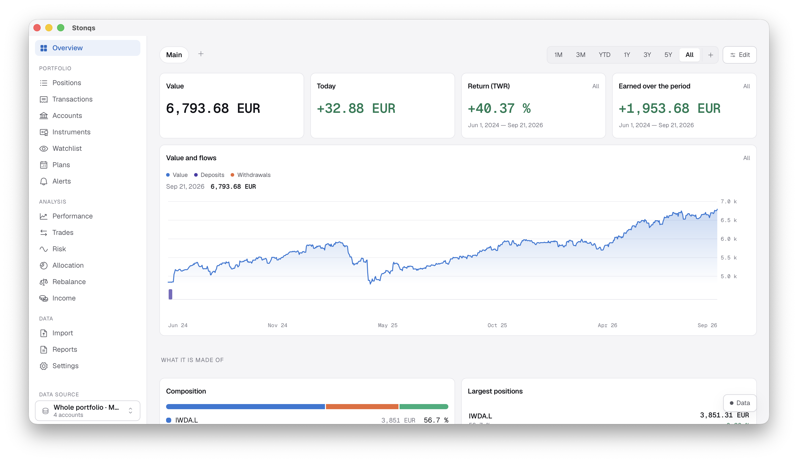

# Stonqs

### Know how your investments are really doing.

A private portfolio tracker with serious analytics — true returns, realised gains,
multi-currency accounts and rebalancing. It runs on your computer, needs no account,
and is free and open source.

**[Download for macOS · Windows · Linux](https://github.com/vvvlladimir/stonqs/releases/latest)**
&nbsp;·&nbsp; [Build from source](CONTRIBUTING.md#getting-set-up)
&nbsp;·&nbsp; [Discussions](https://github.com/vvvlladimir/stonqs/discussions)

<picture>
  <source media="(prefers-color-scheme: dark)" srcset="docs/images/main-dark.png">
  
</picture>

## Is it for you?

Stonqs is for people who invest on their own and have outgrown a spreadsheet: a few brokers, a
couple of currencies, dividends arriving from everywhere — and the nagging question of whether the
portfolio is actually doing well, or just growing because you keep paying into it.

It answers that question properly, keeps everything on your machine, and never asks you to sign up.

## Why Stonqs

**Numbers you can check.** Most apps show one "return" and leave you guessing what it means.
Stonqs shows two, and says which is which: *time-weighted* return tells you how your investments
did, with the timing of your deposits taken out; *money-weighted* return tells you how *you* did,
timing included. Realised gains come from the actual lots a sale used up.

**Your data is a file you own.** No account, no server, no telemetry. Your portfolio is a local
database on your disk. Give a profile a password and the whole database is encrypted. The app goes online
for market data, and for the assistant only if you switch it on — [the full list](#privacy).

**Import without the busywork.** Drop in a broker export in any of a dozen languages. Stonqs works
out the delimiter, encoding, dates, decimal separator and what each column means — and lets you
correct any of it. You see every row before anything is saved, and importing the same file twice
changes nothing.

**An assistant, only if you want one.** Off by default. Bring your own key for OpenAI, Anthropic
or Gemini, or point it at a model running on your own machine. It asks before reading your
portfolio, and asks again — every single time — before changing anything.

## What's inside

**Performance and risk**
- Time-weighted and money-weighted returns over any period, for the portfolio and each position
- Comparison against a benchmark, and returns in real terms after inflation
- Volatility, maximum drawdown and recovery, Sharpe, best and worst days

**Positions, income and costs**
- FIFO or average cost side by side, with currency effects separated from the instrument's own
- Dividends and interest by year and instrument, yield on cost, expected payments
- What the portfolio costs you in fees and taxes

**Allocation and rebalancing**
- Your own classification trees — asset class, region, sector, or anything you invent
- Target weights and suggested trades, rounded to what you can actually buy

**Accounts and data**
- Cash and securities accounts in any currency; every trade keeps the exchange rate it was made at
- Look at one account, a group, or everything, without editing anything
- 29 broker layouts built in (Trade Republic, DEGIRO, Trading 212, IBKR, Saxo, Swissquote,
  Revolut, Coinbase and more), Interactive Brokers Flex statements, and your own layouts for the rest

**Everyday tools**
- Price alerts with a log of every crossing, and watchlists for what you don't own yet
- Savings plans that *propose* the month's transactions instead of writing them behind your back
- A dashboard you arrange yourself, each tile with its own period and accounts
- English and Russian, following your system language

## Get started

1. Download the build for your system from the
   [latest release](https://github.com/vvvlladimir/stonqs/releases/latest).
2. Open it and choose **Try with demo portfolio** to explore with sample data first.
3. When you're ready, create your own profile and import a broker export.

<b>"Unidentified developer" warning?</b> That's expected in the alpha.

 

The builds are not code-signed yet, so your system will warn you the first time:

- **macOS** — move the app to Applications, then run
  `xattr -dr com.apple.quarantine /Applications/Stonqs.app`
- **Windows** — on the SmartScreen dialog, click *More info* → *Run anyway*.

Signing is on the list. Until then you can
[build from source](CONTRIBUTING.md#getting-set-up) — which is exactly why the code is here.

## Privacy

Here is every network call the app makes, and when:

| What | Where it goes | When |
|---|---|---|
| Prices | Yahoo Finance by default; Twelve Data, EODHD or Kraken if you configure them | When quotes are refreshed |
| Exchange rates | European Central Bank, Frankfurter, Yahoo | With quotes |
| Inflation figures | Eurostat, IMF | Only if you pick a region for real returns |
| Instrument lookup | Yahoo, OpenFIGI | When you search for or identify an instrument |
| AI assistant | The provider *you* configured, with *your* key | Only when you use it |
| Update check | GitHub Releases | Once a day; turn it off in Settings → Updates |

Nothing else leaves your machine — no analytics, no crash reports. You can switch
market-data sources, add your own, or turn them off and enter prices by hand.
[SECURITY.md](SECURITY.md) explains exactly what the profile password does and does not protect
against.

## FAQ

**Is it free?**
Yes. The app and everything that runs locally are free and open source under the AGPL, and will
stay that way. If paid services ever appear, they will be things that genuinely cost money to run —
device sync, hosted AI, licensed market data — never a paywall in front of what works today.

**Can it import PDF statements?**
Not yet — CSV and Interactive Brokers Flex XML only. If your broker's export does not import
cleanly, [open an issue](https://github.com/vvvlladimir/stonqs/issues) with five anonymised rows
and the header.

**Does it sync between devices?**
No. There is no server, so there is nothing to sync through. Your data is one folder you can back
up like any other.

**Phone or tablet?**
Not yet. The code is written to run on iOS and Android from the same source, but only desktop
builds ship today.

## Status

**Alpha**, version 0.x. Its author uses it every day and the calculations are covered by tests,
but expect rough edges and keep your broker statements. Before any schema upgrade the app copies
your database beside itself, and reports can be exported at any time.

## Contributing

Issues, broker formats that fail to import, and pull requests are all welcome — start with
[CONTRIBUTING.md](CONTRIBUTING.md). If you attach a broker export, **strip the real amounts and
account numbers first**; five rows and the header are enough.

## Architecture

A Cargo workspace plus a React frontend, layered so dependencies point one way:

- `core/` — the library: domain model, SQLite storage, market-data and FX providers, and all the
  maths. It knows nothing about the interface. See [`core/README.md`](core/README.md).
- `app/` — the Tauri host and the frontend; the only part that knows Tauri exists.
- `cli/` — a small harness for exercising the core by hand. Not a product.

[`CLAUDE.md`](CLAUDE.md) is the map, [`.claude/rules/`](.claude/rules/) holds the per-area rules,
and [`docs/decisions/`](docs/decisions/) holds the reasoning.

## Licence

[AGPL-3.0](LICENSE). You may run, study, change and share it; if you offer a modified version as a
network service, that version's source must be available too.

Every dependency's licence text is collected in
[`THIRD-PARTY-NOTICES.md`](THIRD-PARTY-NOTICES.md), generated by `node scripts/notices.mjs` and
checked in CI. The app ships it: Settings → **About** lists every component and saves the full
texts to a file.

## Disclaimer

Stonqs is a tool for recording and analysing your own investments. It is **not financial advice**,
and neither are the answers of the built-in assistant. Market data comes from free third-party
sources with no guarantee of accuracy, completeness or availability. Check anything that matters
against your broker's own statements — especially anything you intend to put on a tax return. The
same wording is in the app itself, under Settings → **About**.
